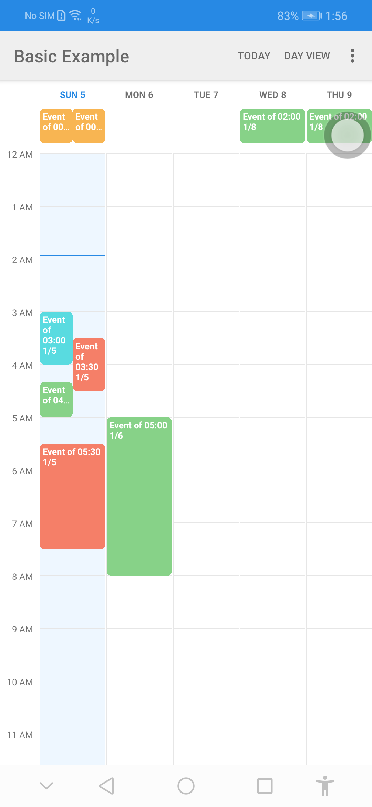

Android Week View
=================

**Android Week View** is an android library to display calendars (week view or day view) within the app. It supports custom styling. Clone from [Android-Week-View](https://github.com/alamkanak/Android-Week-View/).

++ Variation - Vertical divider Added



Features
------------

* Week view calendar
* Day view calendar
* Custom styling
* Horizontal and vertical scrolling
* Infinite horizontal scrolling
* Live preview of custom styling in xml preview window

Usage
---------
1. Add WeekView in your xml layout.

    ```xml
    <com.alamkanak.weekview.WeekView
        android:id="@+id/weekView"
        android:layout_width="match_parent"
        android:layout_height="match_parent"
        app:dayBackgroundColor="#FFFFFF"
        app:eventTextColor="@android:color/white"
        app:headerColumnBackground="#ffffffff"
        app:headerColumnPadding="8dp"
        app:headerColumnTextColor="@color/toolbar_text"
        app:headerRowBackgroundColor="#FFFFFF"
        app:headerRowPadding="12dp"
        app:hourHeight="60dp"
        app:futureBackgroundColor="@color/accent"
        app:noOfVisibleDays="5"
        app:textSize="12sp"
        app:nowLineColor="@color/accent"
        app:nowLineThickness="2dp"
        app:todayBackgroundColor="#1848adff"
        app:showNowLine="true"
        app:eventCornerRadius="5dp"
        app:todayHeaderTextColor="@color/accent" />
    ```
2. Write the following code in your java file.

    ```java
    // Get a reference for the week view in the layout.
    mWeekView = (WeekView) findViewById(R.id.weekView);

    // Set an action when any event is clicked.
    mWeekView.setOnEventClickListener(mEventClickListener);

    // The week view has infinite scrolling horizontally. We have to provide the events of a
    // month every time the month changes on the week view.
    mWeekView.setMonthChangeListener(mMonthChangeListener);

    // Set long press listener for events.
    mWeekView.setEventLongPressListener(mEventLongPressListener);
    ```
3. Implement `WeekView.MonthChangeListener`, `WeekView.EventClickListener`, `WeekView.EventLongPressListener` according to your need.

4. Provide the events for the `WeekView` in `WeekView.MonthChangeListener.onMonthChange()` callback. Please remember that the calendar pre-loads events of three consecutive months to enable lag-free scrolling.

    ```java
    MonthLoader.MonthChangeListener mMonthChangeListener = new MonthLoader.MonthChangeListener() {
        @Override
        public List<WeekViewEvent> onMonthChange(int newYear, int newMonth) {
            // Populate the week view with some events.
            List<WeekViewEvent> events = getEvents(newYear, newMonth);
            return events;
        }
    };
    ```

Customization
-------------------

You can customize the look of the `WeekView` in xml. Use the following attributes in xml. All these attributes also have getters and setters to enable you to change the style dynamically.

- `allDayEventHeight`
- `columnGap`
- `dayBackgroundColor`
- `dayNameLength`
- `eventMarginVertical`
- `eventPadding`
- `eventTextColor`
- `eventTextSize`
- `firstDayOfWeek`
- `headerColumnBackground`
- `headerColumnPadding`
- `headerColumnTextColor`
- `headerRowBackgroundColor`
- `headerRowPadding`
- `hourHeight`
- `hourSeparatorColor`
- `hourSeparatorHeight`
- `noOfVisibleDays`
- `overlappingEventGap`
- `textSize`
- `todayBackgroundColor`
- `todayHeaderTextColor`
- `showDistinctPastFutureColor`
- `futureBackgroundColor`
- `pastBackgroundColor`
- `showDistinctWeekendColor`
- `futureWeekendBackgroundColor`
- `pastWeekendBackgroundColor`
- `showNowLine`
- `nowLineColor`
- `nowLineThickness`
- `scrollDuration`

Interfaces
----------

Use the following interfaces according to your need.

- `mWeekView.setWeekViewLoader()` to provide events to the calendar
- `mWeekView.setMonthChangeListener()` to provide events to the calendar by months
- `mWeekView.setOnEventClickListener()` to get a callback when an event is clicked
- `mWeekView.setEventLongPressListener()` to get a callback when an event is long pressed
- `mWeekView.setEmptyViewClickListener()` to get a callback when any empty space is clicked
- `mWeekView.setEmptyViewLongPressListener()` to get a callback when any empty space is long pressed
- `mWeekView.setDateTimeInterpreter()` to set your own labels for the calendar header row and header column
- `mWeekView.setScrollListener()` to get an event every time the first visible day has changed
- `mWeekView.setPinchListener()` to get an event when the zoom scale reaches maximum

Sample
----------

There is also a [sample app](https://github.com/developersunesis/Android-Week-View/tree/master/sample) to get you started.

Source
-------
Original source from [Android-Week-View](https://github.com/alamkanak/Android-Week-View/)
